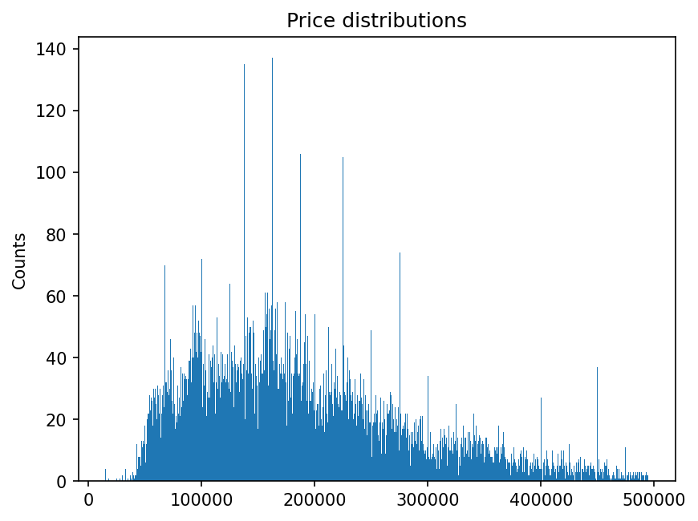
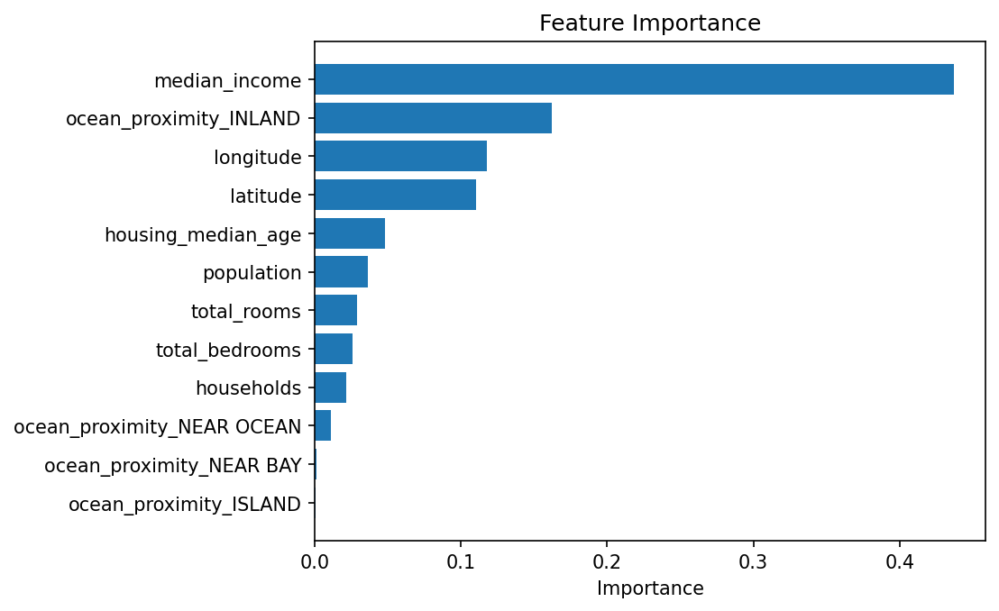
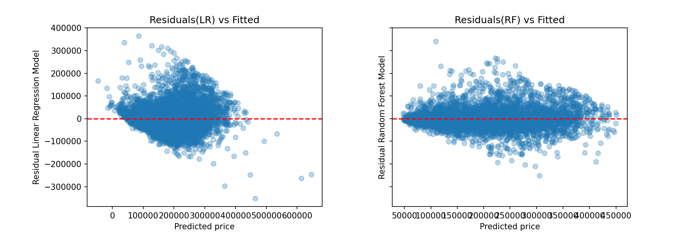
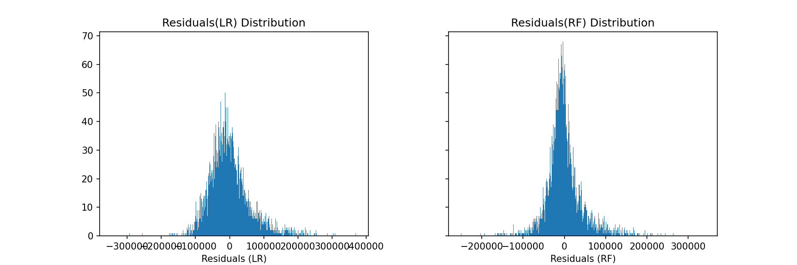
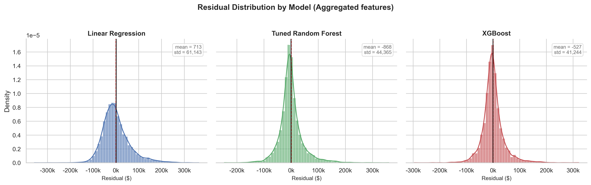
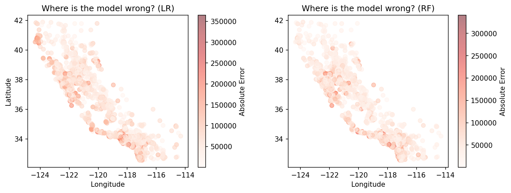

# California Housing Price Prediction

A machine learning project that predicts California median house prices using three models — Linear Regression (SGDRegressor), Random Forest, and XGBoost — with scikit-learn.

---

## Overview

This project covers a full ML pipeline, starting from raw data exploration and cleaning, through to model training, evaluation, and visualisation, using the California Housing dataset. Residual analysis is used not just as a diagnostic tool but as an active driver of feature engineering, with geographic error maps motivating the addition of distance features that improved model performance.

---

## Repository Structure

```
california-housing/
├── README.md
├── California_Housing.ipynb
├── housing.csv
├── requirements.txt
└── images/
    ├── median_house_value_distribution.png
    ├── median_house_value_distribution_filtered.png
    ├── data_vs_price.png
    ├── data_distribution.png
    ├── data_distribution_extra.png
    ├── Test_vs_model.png
    ├── Test_vs_model_rf.png
    ├── feature_importance.png
    ├── residuals_vs_fitted.png
    ├── residual_distribution.png
    ├── residual_distribution_agg.png
    └── error_map.png
```

---

## Dataset

- **Source:** [California Housing Prices](https://www.kaggle.com/datasets/nalisha/california-housing-prices-dataset-clean-and-ml/data)
- **Shape:** 20,640 rows × 10 features (before filtering)
- **Target:** `median_house_value`
- **Features:** `longitude`, `latitude`, `housing_median_age`, `total_rooms`, `total_bedrooms`, `population`, `households`, `median_income`, `ocean_proximity`

---

## Methods

### 1. Data Cleaning
- Filled missing values in `total_bedrooms` with the column median
- Filtered out values near the $500,000 cap, a known artefact in this dataset where prices were top-coded, which distorts model training near the upper end of the price range

### 2. Feature Engineering
- Applied one-hot encoding (`get_dummies`) on `ocean_proximity`, turning 5 categories into 4 binary dummy variables using `drop_first=True`
- `StandardScaler` applied to continuous features only; dummy variables were excluded to avoid the rare-category scaling problem (a near-constant binary column scaled by its tiny standard deviation produces extreme values that destabilise gradient-based optimisers)
- Derived four ratio features with log transformation to reduce skewness:
  - `rooms_per_household` = log(total_rooms / households)
  - `bedrooms_per_room` = log(total_bedrooms / total_rooms)
  - `population_per_household` = log(population / households)
  - `income_x_density` = log(median_income × population / total_rooms)
- Based on geographic residual analysis, added Euclidean distance features to San Francisco, Los Angeles, and San Diego
- Added distance to the nearest coastline using a KD-tree on coastal census block centroids from `ocean_proximity` labels

### 3. Train/Test Split
- 70% training, 30% testing using `train_test_split` with `random_state=42`

### 4. Feature Scaling
- `StandardScaler` (Z-score normalisation: mean=0, std=1) fitted on training data only to avoid data leakage
- Scaling applied to continuous features only; binary dummy variables passed through unscaled

### 5. Models
- **SGDRegressor** (linear regression via Stochastic Gradient Descent) with `max_iter=2000`, trained on both baseline and aggregated feature sets
- **RandomForestRegressor** baseline with `n_estimators=200`, tuned via `RandomizedSearchCV` with 5-fold cross-validation over `n_estimators`, `max_depth`, and `min_samples_split`
- **XGBRegressor** with `n_estimators=500`, `max_depth=6`, `learning_rate=0.05`, trained on the aggregated feature set
- Residual analysis conducted after each modelling phase to identify systematic error patterns and motivate further feature engineering

---

## Results

| Model | Features | R² Score |
|-------|----------|----------|
| Linear Regression (SGD) | Baseline | 0.604 |
| Linear Regression (SGD) | + Aggregated | 0.604 |
| Random Forest (tuned) | Baseline | 0.784 |
| Random Forest (tuned) | + Aggregated | 0.791 |
| XGBoost | + Aggregated | 0.802 |
| XGBoost | + Aggregated | 0.820 |

Linear Regression achieves 60.4% with both baseline and aggregated features, confirming that the feature set ceiling for a linear model on this dataset is around 60%, regardless of ratio-based transformations. The relationship between features and house price is fundamentally non-linear.

Random Forest (tuned) reaches 79.1%, a significant improvement over linear regression, reflecting its ability to capture non-linear splits. XGBoost pushes this further to 80.2% on the same feature set, and to 82.0% after adding geographic distance features (city distances and nearest coastline). The distance features carry genuinely new geographic information that latitude and longitude alone do not fully capture, particularly for properties near major urban centres.

Residual analysis revealed a meaningful trade-off: adding aggregated features improved $R^2$ (reduced the standard deviation of errors) while slightly increasing mean errors across all models. XGBoost retains the best residual profile, with the smallest mean error (−$527) and smallest standard deviation ($41,244) of the three models after feature engineering.

Feature importance analysis shows median income as the strongest predictor by a large margin, consistent with well-established findings in housing economics. Geographical features (latitude, longitude, city distances) collectively contribute the next largest share of predictive power.

### Visualisations

**Target distribution (after filtering)**



**Feature Importance (Random Forest)**



**Residuals vs Fitted (all models)**



**Residual Distributions (all models)**



**Residual Distributions (aggregated features)**



**Geographic Error Map (all models)**



---

## How to Run

1. Clone the repository:
```bash
git clone https://github.com/natwonglakhon/California_Housing_Model.git
cd California_Housing_Model
```

2. Install dependencies:
```bash
pip install -r requirements.txt
```

3. Launch the notebook:
```bash
jupyter notebook California_Housing.ipynb
```

---

## Requirements

```
numpy
pandas
matplotlib
seaborn
scikit-learn
xgboost
scipy
jupyter
```

---

## Lessons Learned

- Always split data before evaluating. Scoring on training data gives a misleadingly optimistic result.
- Fit the scaler on training data only. Fitting on the full dataset leaks test information into the model.
- Scale continuous features only. Applying `StandardScaler` to near-constant binary dummy variables (e.g. a very rare one-hot category) produces extreme scaled values that can destabilise gradient-based optimisers like SGDRegressor.
- Data quality has a real impact. Removing the top-coded $500k values improved model behaviour near the upper end of the price distribution.
- Linear regression has a ceiling on this dataset. When the underlying relationships are non-linear, no amount of feature engineering or tuning overcomes the model's structural limit.
- Feature engineering helps linear models but not always tree-based ones. Ratio features gave no improvement to Random Forest, but geographically-motivated distance features did, because they carry genuinely new spatial information rather than recombinations of existing features.
- Residual analysis is more than a diagnostic. Mapping errors geographically revealed that both models struggled most in dense urban and coastal areas, directly motivating the distance features that improved $R^2$.
- There is a bias–variance trade-off in feature engineering. Adding aggregated features reduced error variance (smaller std) while slightly increasing mean error. Which side of this trade-off matters depends on the application.
- `RandomizedSearchCV` is a practical alternative to `GridSearchCV` for large parameter spaces. It finds a strong configuration without exhaustively trying every combination.

---

## Future Improvements

- Add cluster-based location encoding (e.g. KMeans on lat/lon) as a richer alternative to fixed-city distance features
- Try permutation importance alongside split-based importance for a less biased view of feature contributions
- Add a predicted vs actual scatter plot for a cleaner visualisation of calibration quality
- Investigate the properties where all three models consistently underperform to understand whether additional features or data sources (school ratings, crime rates, transit access) could close the gap
