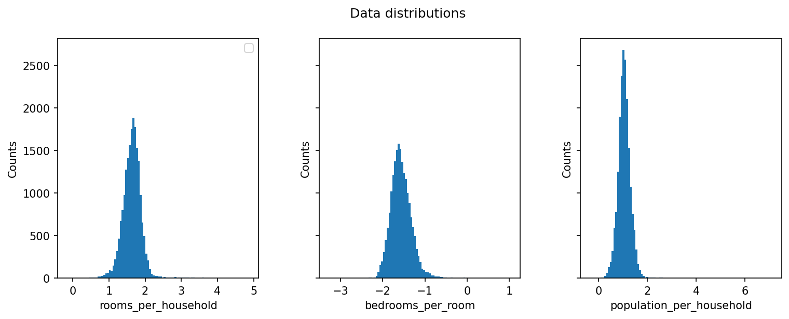

# California Housing Price Prediction

A machine learning project that predicts California median house prices using two models, linear regression (SGDRegressor) and Random Forest, with scikit-learn.

---

## Overview

This project covers a full ML pipeline, starting from raw data exploration and cleaning, through to model training, evaluation, and visualisation, using the California Housing dataset.

---

## Repository Structure

```
california-housing/
├── README.md
├── California_Housing.ipynb
├── housing.csv
├── requirements.txt
└── images/
    ├── median_house_value_distribution.png
    ├── median_house_value_distribution_filtered.png
    ├── data_vs_price.png
    ├── data_distribution.png
    ├── data_distribution_extra.png
    ├── Test_vs_model.png
    ├── Test_vs_model_rf.png
    ├── feature_importance.png
    ├── residuals_vs_fitted.png
    ├── residual_distribution.png
    └── error_map.png
```

---

## Dataset

- **Source:** [Kaggle - California Housing Prices](https://www.kaggle.com/datasets/nalisha/california-housing-prices-dataset-clean-and-ml/data)
- **Shape:** 20,640 rows x 10 features (before filtering)
- **Target:** `median_house_value`
- **Features:** `longitude`, `latitude`, `housing_median_age`, `total_rooms`, `total_bedrooms`, `population`, `households`, `median_income`, `ocean_proximity`

---

## Methods

### 1. Data Cleaning
- Filled missing values in `total_bedrooms` with the column median
- Filtered out capped values near $500,000, which is a known artefact in this dataset that hurts model performance

### 2. Feature Engineering
- Applied one-hot encoding (`get_dummies`) on the categorical `ocean_proximity` column, turning 5 categories into 4 dummy variables using `drop_first=True`
- Derived four aggregated features from existing columns to capture ratio-based relationships:
  - `rooms_per_household` = log(total_rooms / households)
  - `bedrooms_per_room` = log(total_bedrooms / total_rooms)
  - `population_per_household` = log(population / households)
  - `income_x_density` = log(median_income x population / total_rooms)
- Log transformation was applied to reduce skewness in the derived ratios
- After residual analysis revealed that the worst predictions were concentrated around major cities, added Euclidean distance features to San Francisco, Los Angeles, and San Diego

### 3. Train/Test Split
- Split the data 70% training and 30% testing using `train_test_split` with `random_state=42`

### 4. Feature Scaling
- Used `StandardScaler` (Z-score normalisation: mean=0, std=1)
- The scaler was fitted only on training data to avoid data leakage into the test set

### 5. Models
- Trained a **SGDRegressor** (Stochastic Gradient Descent linear regression) with `max_iter=2000`, both with and without aggregated features
- Trained a **RandomForestRegressor** as a baseline with `n_estimators=200`
- Tuned the Random Forest using **RandomizedSearchCV** with 5-fold cross validation, searching over `n_estimators`, `max_depth`, and `min_samples_split` across 24 random combinations
- Conducted residual analysis to identify where each model underperforms
- Added city distance features based on residual error map findings and retrained both models

---

## Results

| Metric | LR (baseline) | LR (+ ratios) | LR (+ city dist) | RF (baseline) | RF (tuned) | RF (+ city dist, tuned) |
|--------|--------------|---------------|------------------|---------------|------------|------------------------|
| R2 Score | 0.615 | 0.640 | 0.648 | 0.790 | 0.791 | 0.804 |

Linear Regression improves from 61.5% to 64% when ratio-based aggregated features are added. Adding city distance features improves it further, as proximity to major urban centres is a meaningful signal that latitude and longitude alone do not fully capture for a linear model.

Random Forest reaches 79.1% as a baseline, with the tuned model matching this score. However, adding city distance features does improve the RF model, unlike the ratio features which were already implicitly discovered through splits. Distance to Los Angeles in particular shows a feature importance of 0.04, indicating it carries genuine new information.

Residual analysis revealed that both models struggle most with properties in dense urban areas around San Francisco and Los Angeles, where prices are more volatile and harder to predict from the available features alone.

Looking at feature importance, median income remains the strongest predictor by a significant margin, accounting for 43.6% of the model's decisions. Location features (latitude, longitude, and city distances) are the next most influential, which makes intuitive sense given how strongly neighbourhood affects property value.

### Visualisations

**Target distribution (after filtering)**


**Feature vs Price**


**Aggregated feature distributions**



**Test data vs Linear Regression Prediction**


**Test data vs Random Forest Prediction**


**Feature Importance (Random Forest)**


**Residuals vs Fitted (LR and RF)**


**Residual Distributions (LR and RF)**


**Geographic Error Map (LR and RF)**


---

## How to Run

1. Clone the repository:
```bash
git clone https://github.com/natwonglakhon/california-housing.git
cd california-housing
```

2. Install dependencies:
```bash
pip install -r requirements.txt
```

3. Launch the notebook:
```bash
jupyter notebook California_Housing.ipynb
```

---

## Requirements

```
numpy
pandas
matplotlib
scikit-learn
jupyter
```

---

## Lessons Learned

- Always split your data before evaluating. Scoring on training data gives a misleadingly good result.
- Fit the scaler on training data only. Fitting on the full dataset leaks test information into the model.
- Data quality has a real impact. Removing the capped $500k values gave a noticeable improvement in R2.
- Linear regression has limits. When the underlying relationships are non-linear, the model will hit a ceiling no matter how well you tune it.
- Feature engineering helps linear models but not always tree-based ones. Ratio features made no difference to Random Forest, but domain-informed features like city distances did, because they carry genuinely new geographic information.
- Residual analysis is more than a diagnostic tool. Plotting errors on a geographic map directly revealed where the model was struggling and motivated the city distance features.
- Feature importance gives meaning to the model's score. Knowing that median income drives 43.6% of predictions is far more useful than a number alone.
- RandomizedSearchCV is a practical alternative to GridSearchCV when the parameter space is large. It finds a good configuration without trying every single combination.

---

## Future Improvements

- Try XGBoost to see if it can push R2 beyond the current best score
- Add more city distance features or cluster-based location encoding
- Try permutation importance alongside split-based importance to get a less biased view of feature contributions
- Add a predicted vs actual scatter plot for a cleaner visualisation of model accuracy
