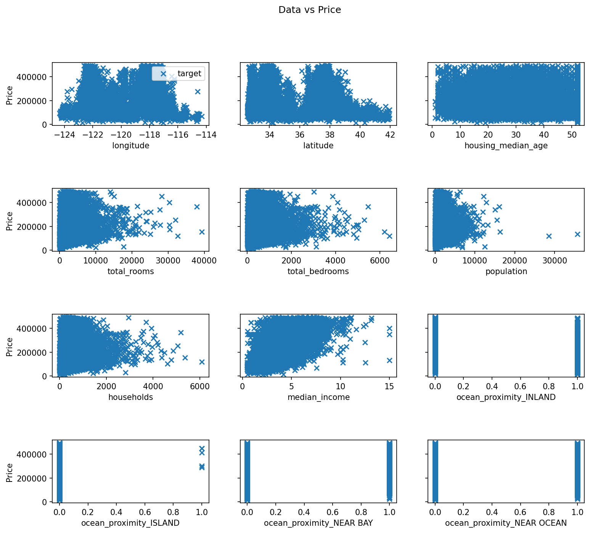
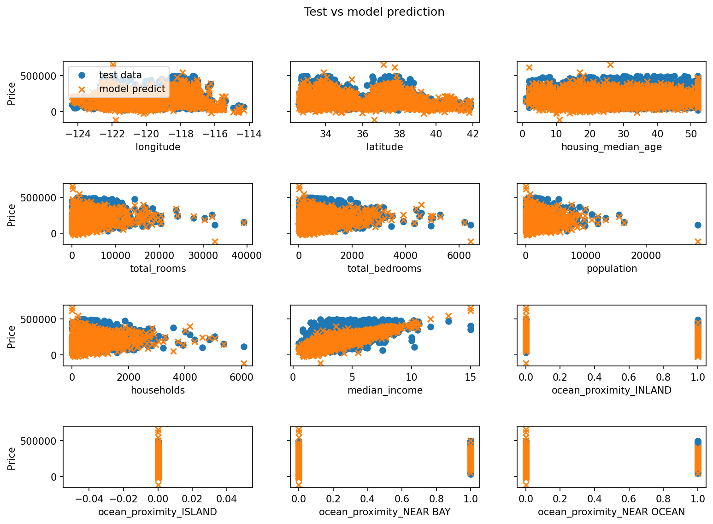
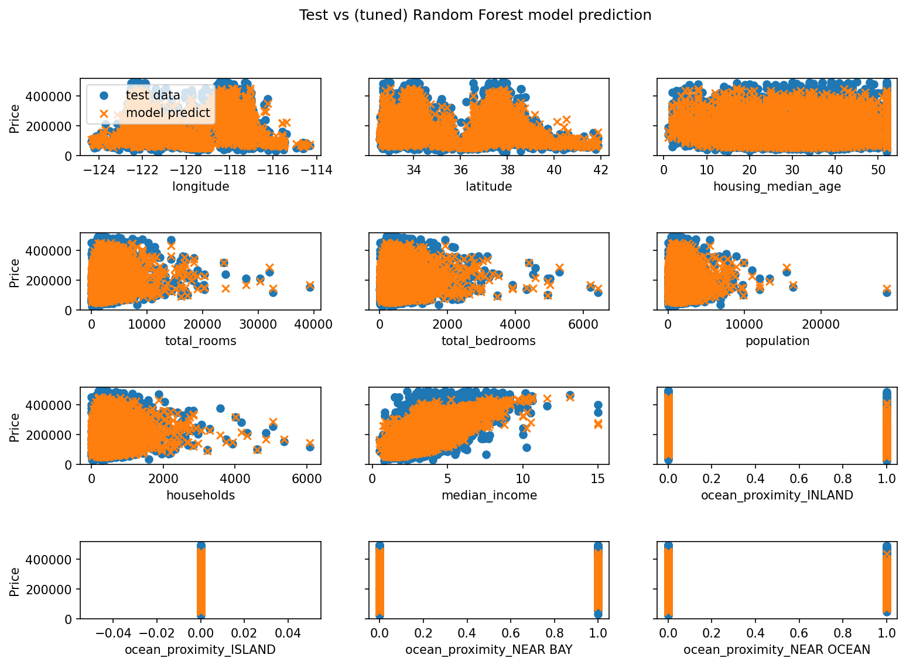

# California Housing Price Prediction

A machine learning project that predicts California median house prices using two models, linear regression (SGDRegressor) and Random Forest, with scikit-learn.

---

## Overview

This project covers a full ML pipeline, starting from raw data exploration and cleaning, through to model training, evaluation, and visualisation, using the California Housing dataset.

---

## Repository Structure

```
california-housing/
├── README.md
├── California_Housing.ipynb
├── housing.csv
├── requirements.txt
└── images/
    ├── median_house_value_distribution.png
    ├── median_house_value_distribution_filtered.png
    ├── data_vs_price.png
    ├── data_distribution.png
    ├── Test_vs_model.png
    ├── Test_vs_model_rf.png
    └── feature_importance.png
```

---

## Dataset

- **Source:** [Kaggle - California Housing Prices](https://www.kaggle.com/datasets/nalisha/california-housing-prices-dataset-clean-and-ml/data)
- **Shape:** 20,640 rows x 10 features (before filtering)
- **Target:** `median_house_value`
- **Features:** `longitude`, `latitude`, `housing_median_age`, `total_rooms`, `total_bedrooms`, `population`, `households`, `median_income`, `ocean_proximity`

---

## Methods

### 1. Data Cleaning
- Filled missing values in `total_bedrooms` with the column median
- Filtered out capped values near $500,000, which is a known artefact in this dataset that hurts model performance

### 2. Feature Engineering
- Applied one-hot encoding (`get_dummies`) on the categorical `ocean_proximity` column, turning 5 categories into 4 dummy variables using `drop_first=True`

### 3. Train/Test Split
- Split the data 70% training and 30% testing using `train_test_split` with `random_state=42`

### 4. Feature Scaling
- Used `StandardScaler` (Z-score normalisation: mean=0, std=1)
- The scaler was fitted only on training data to avoid data leakage into the test set

### 5. Models
- Trained a **SGDRegressor** (Stochastic Gradient Descent linear regression) with `max_iter=2000`
- Trained a **RandomForestRegressor** as a baseline with `n_estimators=200`
- Tuned the Random Forest using **RandomizedSearchCV** with 5-fold cross validation, searching over `n_estimators`, `max_depth`, and `min_samples_split` across 15 random combinations

---

## Results

| Metric | Linear Regression | Random Forest (baseline) | Random Forest (tuned) |
|--------|------------------|--------------------------|----------------------|
| R2 Score | 0.615 | 0.790 | 0.791 |

Linear regression lands at 61.5% R2. Switching to Random Forest pushes this up to 79.1%, with the tuned model matching the baseline. The modest gain from tuning suggests the default Random Forest configuration is already well suited to this dataset, but the process confirms that the parameters are in a reasonable range.

The improvement over linear regression comes from the model being able to capture non-linear relationships in the data. Looking at feature importance, median income is by far the strongest predictor, accounting for 43.6% of the model's decisions. Location features (latitude and longitude) are the next most influential, which makes intuitive sense for housing prices.

### Visualisations

**Target distribution (after filtering)**


**Feature vs Price**



**Test data vs Linear Regression Prediction**



**Test data vs Random Forest Prediction**



**Feature Importance (Random Forest)**


---

## How to Run

1. Clone the repository:
```bash
git clone https://github.com/natwonglakhon/california-housing.git
cd california-housing
```

2. Install dependencies:
```bash
pip install -r requirements.txt
```

3. Launch the notebook:
```bash
jupyter notebook California_Housing.ipynb
```

---

## Requirements

```
numpy
pandas
matplotlib
scikit-learn
jupyter
```

---

## Lessons Learned

- Always split your data before evaluating. Scoring on training data gives a misleadingly good result.
- Fit the scaler on training data only. Fitting on the full dataset leaks test information into the model.
- Data quality has a real impact. Removing the capped $500k values gave a noticeable improvement in R2.
- Linear regression has limits. When the underlying relationships are non-linear, the model will hit a ceiling no matter how well you tune it.
- Random Forest handles non-linearity well but comes at a cost of higher training time and less interpretability.
- Feature importance gives meaning to the model's score. Knowing that median income drives 43.6% of predictions is far more useful than a number alone.
- RandomizedSearchCV is a practical alternative to GridSearchCV when the parameter space is large. It finds a good configuration without trying every single combination.

---

## Future Improvements

- Try XGBoost to see if it can push R2 beyond the current 79.1%
- Explore additional feature engineering, such as rooms per household or bedrooms per room
- Add a correlation heatmap to complement the feature importance analysis
- Add a predicted vs actual scatter plot to visualise model accuracy more intuitively

